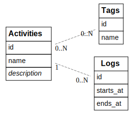

# ⚙️ boat-lib

Rust utility library for [`boat`](https://github.com/coko7/boat).

[](https://crates.io/crates/boat-lib)
[](LICENSE)

[](https://github.com/coko7/boat-lib/actions/workflows/rust.yml)

> [!WARNING]  
> 🚧 Work in Progress
>
> This library is actively being developed. Since it's in its early stages, things will likely break often.
> Don't use it for now.

## Schema

Entity Relationship Diagram (ERD) made with [kroki.io](https://kroki.io/#try):



## Build options

You can compile with:
```shell
cargo build
```
> [!NOTE]
> `boat-lib` relies on [`rusqlite`](https://crates.io/crates/rusqlite) to interact with SQLite.
> By default, it uses `rusqlite` without the `bundled` feature so it requires that you have SQLite installed on your system.
> If you wish to use a bundled version of SQLite instead, you need to enable the `bundled-sqlite` feature:
```shell
cargo build --features bundled-sqlite
```
